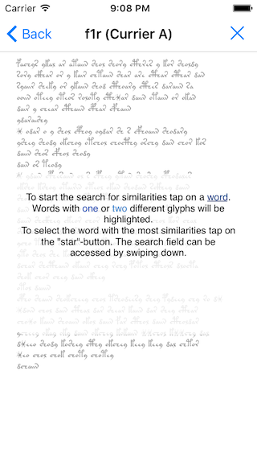

# VoynichTextGenerator

The <a href="https://en.wikipedia.org/wiki/Voynich_manuscript">Voynich Manuscript</a> is a mysterious medieval manuscript. It contains a text in an unknown script. Since its discovery in 1912 the manuscript has attracted the attention of numerous researchers. So far, however, nobody has been able to reveal the secret of the unknown script.

The app is available via iTunes:
<a href="https://itunes.apple.com/us/app/voynichtextgenerator/id1083587101">https://itunes.apple.com/us/app/voynichtextgenerator/id1083587101</a>

The purpose of this papp is to illustrate my hypothesis about the Voynich Manuscript. They generates pseudo text with features similar to that of the Voynich Manuscript.

The app also allows to search for similarities within the text of the Voynich Manuscript.

The hypothesis about the Voynich Manuscript was published via the following two papers:

<a href="http://arxiv.org/abs/1407.6639">How the Voynich Manuscript was created</a>
------------

This <a href="http://arxiv.org/pdf/1407.6639v3">paper</a> studies the relation between similarly spelled words in the Voynich manuscript. By means of a detailed analysis of similar spelled words it was possible to reveal the text generation method used for the Voynich manuscript.

<a href="http://arxiv.org/abs/1601.07435">Co-Occurrence Patterns in the Voynich Manuscript</a>
------------

This <a href="http://arxiv.org/pdf/1601.07435v2">paper</a> studies the distribution of similarly spelled words in the Voynich Manuscript. It shows that the distribution of words within the manuscript is not compatible with natural languages.